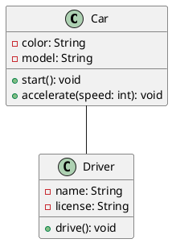
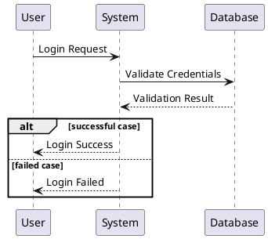
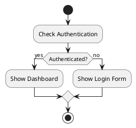
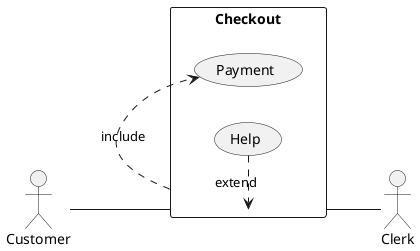
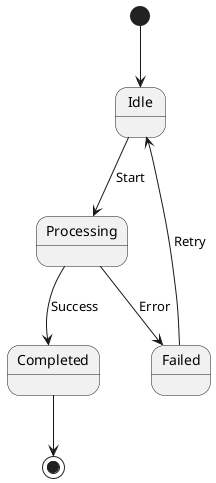
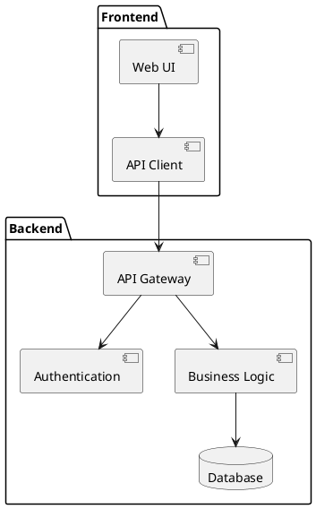

# UML Diagrams

UML-MCP supports various UML diagram types through PlantUML.

## Class Diagrams

Class diagrams show the static structure of a system:



## Sequence Diagrams

Sequence diagrams show object interactions arranged in time sequence:



## Activity Diagrams

Activity diagrams show workflows or business processes:



## Use Case Diagrams

Use case diagrams show system functionality and actors:



## State Diagrams

State diagrams show states of an object during its lifecycle:



## Component Diagrams

Component diagrams show components and dependencies:



## Tips for UML Diagrams

1. Use PlantUML preprocessor for advanced features:
   ```plantuml
   !include https://raw.githubusercontent.com/plantuml-stdlib/C4-PlantUML/master/C4_Container.puml
   ```

2. Apply themes for better visuals:
   ```plantuml
   @startuml
   !theme cerulean
   class Example
   @enduml
   ```

3. Use notes for additional information:
   ```plantuml
   @startuml
   class User
   note right of User: This class represents system users
   @enduml
   ```
